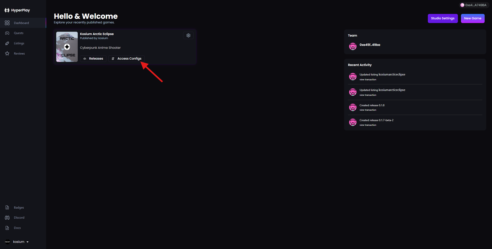

# How to create access codes

## Creating a new access config with access codes walkthrough

1. Log into the dev portal and click "Access Configs"

<figure><figcaption></figcaption></figure>

2. Click "Create Access Config"

<figure><figcaption></figcaption></figure>

3. Enter an access config title, check "Requires Access Codes", and enter the number of access codes you would like to generate.

<figure><figcaption></figcaption></figure>

4. Copy and share your codes with players.

<figure><figcaption></figcaption></figure>

5. Navigate to `https://developers.hyperplay.xyz/<account_name>/<project_name>/settings`  directly or by clicking on your game card on the home page. Next, select the new access config in the dropdown for the desired channel. Click update. Now your release channel downloads will be gated by the selected access config.

<figure><figcaption></figcaption></figure>
